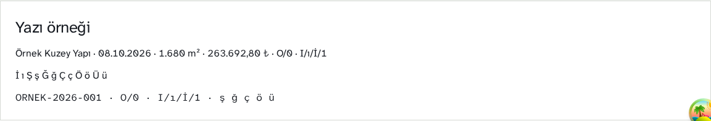

# Faz 0 tamamlandı — 8 Ekim 2026

Çalışan önizleme: http://127.0.0.1:3210/  
Dal: `codex/ofis-redesign-20261008`  
Çalışma ağacı: `.worktrees/ofis-redesign-20261008`  
Sonraki adım: [Faz 1 karar dosyası](PHASE-1-DECISION.md). Şema veya kayıt mutasyonu uygulanmadı; push/merge/deploy yapılmadı.

## Değişenler

- Ofis layout'una yerel Atkinson Hyperlegible Next ve Mono bağlandı; açık Sevk Masası paleti sadece Ofis'e uygulandı. Public site tasarımı değiştirilmedi.
- Minimum metin 14 px; gövde, form ve tablo hücreleri 16 px; başlıklar 19/26/40 px. Eski 9–13 px sınıfları ve grafik yazıları düzeltildi. Fiyatlarda tabular nums; teknik kimliklerde Mono.
- Altı ana bölüm ve `/ofis` korundu. Dekoratif parlamalar kaldırıldı, hiyerarşi yüzey/sınır/boşlukla kuruldu.
- Teklif satırında Detay ana eylem oldu. PDF, Revize, Çoğalt ve onay isteyen Sil, Diğer grubuna taşındı. Durum/öncelik kontrolleri aynı API davranışıyla bu grupta kaldı. Menü klavye, Escape, dış tıklama ve odak dönüşünü destekliyor.
- Satır ve katalog filtreleri gerçekten yeniden akıyor. `.nx-shell` içindeki yatay taşma gizleme kaldırıldı; kontrol kırpılarak gizlenmiyor. Dokunma hedefi en az 44×44 px.
- Hesap motoru, satış durumu anahtarları, Supabase yazma yolları, Basic Auth ve handler rol kapıları değiştirilmedi.

## Fontun üç ayrı kanıtı

Başlangıç ölçümü gerçek veriye bağlanmadan, değişiklik öncesi aynı bileşenlerin sentetik kopyasında yapıldı. Canlı gerçek-veri uygulamasına tarayıcıyla girilmedi.

1. **CSS:** Kök layout Geist değişkenini body'ye koyuyor; fakat `globals.css` içindeki `body { font-family: var(--font-sans), ... }` ifadesinde `--font-sans` ölçümde boştu. `@theme inline` tanımı gerçek bir body değişkeni yerine utility üretiminde kullanılıyor. Geçersiz font deklarasyonu sistem ailesine düşüyordu. Ofis layout'u artık fontu doğrudan bağlı yerel değişkenden okuyor.
2. **Yükleme:** `document.fonts` ve ağ kaydında Ofis'in Next/Mono dosyaları yerel `/_next/static/media/` üzerinden yüklendi. CSS'te tanımlı ama kullanılmayan bir ailenin `unloaded` olması fontun ekranda kullanıldığını kanıtlamaz.
3. **Rendered Fonts:** Chrome CDP `CSS.getPlatformFontsForNode`: başlangıç gövde örneği Noto Sans; yeni gövde Atkinson Hyperlegible Next, teknik satır Atkinson Hyperlegible Mono. `İ ı Ş ş Ğ ğ Ç ç Ö ö Ü ü` satırının tamamı Atkinson Next; teknik satırdaki Türkçe de Mono.

Gerçek HTML örneği aşağıda ve önizlemenin sonunda bulunur: müşteri adı, 08.10.2026, 1.680 m², 263.692,80 ₺, O/0, I/ı/İ/1. Sıfır glifi değiştirilmedi; desteklenmeyen OpenType varsayımı yok.

**₺ ayrıntısı:** Resmî Atkinson Next ve Mono dosyalarının cmap tablosunda Türk lirası simgesi yok. Mevcut Geist dosyasında da bulunmadığı doğrulandı. Son uygulamada yalnız bu glif, mevcut yerel Barlow'dan tamamlanıyor; Türkçe harfler ve fiyat rakamları Atkinson'da. CDP örnekte 70 Atkinson + 1 Barlow glifi bildiriyor. İlk denemede görülen sistem fallback'i son uygulamada kaldırıldı.

Kaynak: [Atkinson Next resmî dosyaları](https://github.com/google/fonts/tree/main/ofl/atkinsonhyperlegiblenext), [Atkinson Mono resmî dosyaları](https://github.com/google/fonts/tree/main/ofl/atkinsonhyperlegiblemono). Lisanslar `public/fonts/ofis/` altında. Mevcut Next 16.3.3 font API'sinde iki aile ve latin/latin-ext destekleniyor; çevrimdışı doğrulanabilir tam font dosyaları için `next/font/local` kullanıldı.

## Ölçüm sonuçları

| Kontrol | Sonuç |
|---|---|
| 6 bölüm × 375/390/768/1440 px | 24 görünüm geçti |
| Mobil Diğer / detay / revize editörü | 3 görünüm geçti |
| %200 CSS büyütme + 720 px yeniden akış eşdeğeri | 2 görünüm geçti; gerçek tarayıcı menüsünden zoom uygulandığı iddia edilmiyor |
| Görünür metin <14 px | 0 |
| Ölçülen metin kontrastı <4,5:1 | 0; gradyan nedeniyle atlanan metin 0 |
| Görünür işlem hedefi <44×44 px | 0 |
| İşlem kontrolü yatay kırpılması | Önce 375 px'de 18 → sonra 0 |
| Ana metin / beyaz, zemin | 17,79:1 / 16,13:1 |
| İkincil metin / beyaz, zemin | 7,86:1 / 7,13:1 |
| Beyaz ana düğme yazısı / #C2410C | 5,18:1 |
| WhatsApp metni / beyaz | 5,35:1 |
| Tarayıcı çalışma zamanı hatası | 0 |
| Dış ağ isteği | 0 |
| Klavye ve silme | Enter açar; Tab gruba girer; Escape kapatır ve odağı döndürür; silme onayı iptal edildi, DELETE gönderilmedi |
| Revize erişimi | Mevcut editör örnek teklif ile açıldı; kayıt gönderilmedi |
| Salt okunur patron | Yeni teklif, revize, çoğalt, sil ve durum/öncelik yazma kontrolleri gösterilmedi |
| Yazma geçidi | API PATCH, PDF POST, REST DELETE, auth POST, storage PUT → tamamı yerelde 405 |
| Node dış ağ engeli | fetch/socket/DNS dış hedefe istek başlamadan engellendi |
| TypeScript | Geçti |
| ESLint | 0 hata; mevcut logout tam sayfa yönlendirmesi için 1 uyarı korunuyor |
| Mevcut otomatik testler | 8 dosya, 71 test geçti: auth/rol kapıları, fiyat hesabı, teklif gösterge ve çoğaltma |
| Next production build | Geçti: ayrı loopback sunucuda boş katalog, dummy anahtarlar ve dış ağ engeliyle. Üretim katalog verisiyle build veya yayın doğrulaması değildir. |
| Diff boşluk kontrolü | Geçti |

İlk güvenli build denemesi, önizlemedeki örnek ürünün public statik üretim için gerekli slug'ı olmadığı için durdu; uygulama kaynak kodu değiştirilmeden build veri sağlayıcısı ayrı boş katalog olarak düzenlendi. Son build başarılıdır.

Kanıtlar: [tarayıcı JSON](evidence/phase0-validation.json), [başlangıç JSON](evidence/baseline.json), [build çıktısı](evidence/build.log), [lint çıktısı](evidence/lint.log), [ağ engeli](evidence/isolation.json), [tasarım kontrolü](evidence/design-check.json).

Bu tarama altı ana bölüm, teklif detayı ve revize ekranındaki mevcut sentetik durumları kapsar. Boş örnek tabloların tüm dolu/başarısız/kayıt sonrası durumları veya bütün alt sekmeler için eksiksiz erişilebilirlik sertifikası değildir.

## Ekran görüntüleri

| Genişlik | Genel Bakış | Teklifler | Analiz |
|---|---|---|---|
| 375 px | [Görüntü](evidence/phase0-dashboard-375.png) | [Görüntü](evidence/phase0-quotes-375.png) | [Görüntü](evidence/phase0-analytics-375.png) |
| 390 px | [Görüntü](evidence/phase0-dashboard-390.png) | [Görüntü](evidence/phase0-quotes-390.png) | [Görüntü](evidence/phase0-analytics-390.png) |
| 768 px | [Görüntü](evidence/phase0-dashboard-768.png) | [Görüntü](evidence/phase0-quotes-768.png) | [Görüntü](evidence/phase0-analytics-768.png) |
| 1440 px | [Görüntü](evidence/phase0-dashboard-1440.png) | [Görüntü](evidence/phase0-quotes-1440.png) | [Görüntü](evidence/phase0-analytics-1440.png) |

[375 px detay](evidence/phase0-detail-375.png) · [%200 büyütme](evidence/phase0-zoom-200.png). Tam boy ekranlarda yalnız sentetik isim ve tutarlar bulunur.

## Görev 1–4 karşılaştırmasının mevcut sınırı

| Görev | Önce / sonra şu an doğrulanabilen | Tam görev ölçümü |
|---|---|---|
| 1. Yeni talebi bul ve iletişim bağlantısını aç | 375 px eski Detay x=439–521, ekran dışında. Yeni Detay ekran içinde ve satırdan 1 tıkla açılıyor. İletişim akışı Faz 2'yi bekliyor. | Tamamlanmadı; insan süresi veya temas dönüşüm artışı uydurulmadı. |
| 2. Görüşme ve takip kaydet, yenile | Mevcut alanlar yerinde. Kayıt geçidi kapalı. | Test DB ve Faz 1 gerekli; süre/tıklama karşılaştırması ölçülmedi. |
| 3. Geciken takibi tamamla | Mevcut tek tarih alanı gerçek görev yaşam döngüsü değil. | Yeni görev modeli karar bekliyor; ölçülmedi. |
| 4. Yeni teklif, PDF, revize ve fark karşılaştırma | Revize editörüne satırdan Diğer + Revize = 2 tık. Önceden masaüstünde 1 tıktı; mobilde kontroller taşabiliyordu. Görsel yoğunluk azaltılırken bu ek tık bilinçli. | Kayıt/PDF/sürüm kalıcılığı testi yapılmadı; tam görev süresi ölçülmedi. |

## Tasarım denetleyicisi değerlendirmesi

- Düzeltildi: menüde gereksiz kalın kenar; 6 px köşe yerine 8 px.
- Dar istisna: kök public-site DESIGN.md paletinden farklı, talimatta istenen 14/19/26 px ölçüler ve Ofis açık temasının yardımcı durum/odak/sınır tonları; toplam 15 tekil değer, yalnız `app/ofis/ofis.css`. Genel kural veya dosya kapatılmadı.
- Son tasarım kontrolünde açık bulgu yok. Önceden mevcut logout ESLint uyarısı auth davranışına dokunmadan bırakıldı.

## Bekleyen fazlar

Faz 1 şema ve proje tutarı kuralı için [hazırlanmış çözüm](PHASE-1-DECISION.md) bekliyor. Bugün görev panosu, kalıcı temas/takip, Teknik Föy bölünmüş görünümü ve teklif editörünün Faz 4 düzeni tamamlandı denmiyor. Eski huni ve bazı talep türü etiketleri bu geçiş önizlemesinde hâlâ mevcut; bunlar yeni iş modeli olarak kabul edilmedi.
